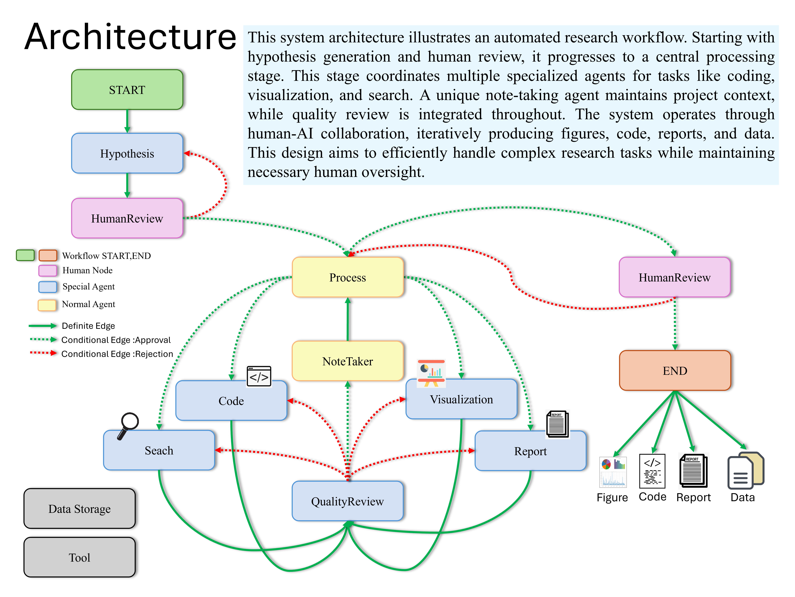

Here’s a **GitHub-viral, high-impact, marketing-driven README version** designed to attract attention, stars, and contributors while still staying technically credible.

---

# 🚀 DATATEX

### AI-Powered Multi-Agent Data Science Engine

> Turn raw data into **insights, hypotheses, visual reports, and research-grade analysis — fully automated.**



---

## ⚡ What is DATATEX?

DATATEX is a **next-generation AI data analysis system** that replaces traditional manual data science workflows with an **autonomous multi-agent intelligence system**.

Instead of writing notebooks, cleaning data, building models, and generating reports manually…

👉 You just describe what you want.

DATATEX handles the rest.

---

## 🧠 Why DATATEX Exists

Modern data workflows are:

* Slow 🐢
* Manual 🧑‍💻
* Repetitive 🔁
* Hard to scale 📉

DATATEX changes that by introducing a **fully autonomous research pipeline powered by collaborating AI agents**.

---

## 🔥 Core Capabilities

### 🧪 Autonomous Research Engine

* AI generates hypotheses automatically
* Self-refining research direction
* Iterative validation loop

### 📊 Zero-Effort Data Analysis

* Automatic data cleaning
* Feature understanding & transformation
* ML-ready pipeline generation

### 📈 Instant Visual Intelligence

* Beautiful charts generated automatically
* Insight extraction without prompting
* Report-ready visual storytelling

### 🧾 Full Report Generation

* End-to-end research papers
* Business-ready analytics reports
* Structured narrative + findings

---

## 🧩 Multi-Agent Brain System

DATATEX is powered by a **coordinated swarm of specialized AI agents**:

| Agent                  | Role                       |
| ---------------------- | -------------------------- |
| 🧠 Hypothesis Agent    | Generates research ideas   |
| ⚙️ Process Agent       | Orchestrates workflow      |
| 📊 Visualization Agent | Builds charts & graphs     |
| 💻 Code Agent          | Writes analysis code       |
| 🔍 Search Agent        | Finds external knowledge   |
| 🧾 Report Agent        | Writes final reports       |
| 🧪 Quality Agent       | Validates outputs          |
| 📝 Note Agent          | Maintains memory & context |

👉 Think of it as a **self-managing data science team in a box.**

---

## 🏗️ System Architecture

DATATEX uses:

* 🧠 LangGraph → workflow orchestration
* 🔗 LangChain → agent chaining
* 🤖 LLMs → OpenAI / Claude / Gemini / Ollama
* 🧩 MCP tools → external system integration

---

## 💡 What Makes DATATEX Different?

### 🧠 1. True Multi-Agent Intelligence

Not a single model. A **team of AI specialists collaborating in real time.**

### 🧠 2. Memory-Driven Reasoning

A persistent note-taking system ensures:

* No lost context
* Continuous reasoning
* Long-running research continuity

### 🧠 3. Fully Autonomous Workflow

From raw CSV → final report:

👉 No manual intervention required

---

## ⚙️ Installation

### 1. Clone the Repo

```bash
git clone https://github.com/starpig1129/DATATEX.git
cd DATATEX
```

### 2. Create Environment

```bash
conda create -n DATATEX python=3.10
conda activate DATATEX
```

### 3. Install Dependencies

```bash
pip install -r requirements.txt
```

---

## 🔐 Configuration

Rename `.env Example → .env`

```bash
WORKING_DIRECTORY=./data/
CONDA_ENV=DATATEX

CHROMEDRIVER_PATH=./chromedriver-linux64/chromedriver

# LLM APIs
OPENAI_API_KEY=xxxx
ANTHROPIC_API_KEY=xxxx
GOOGLE_API_KEY=xxxx

# Optional intelligence boosters
FIRECRAWL_API_KEY=xxxx
TAVILY_API_KEY=xxxx
GITHUB_TOKEN=xxxx
LANGCHAIN_API_KEY=xxxx
```

---

## 🚀 Quick Start

### Drop your dataset into `/data`

Then run:

```bash
python main.py
```

### Example prompt:

```python
user_input = '''
datapath:YourDataName.csv
Perform full machine learning analysis and generate a professional report with visuals
'''
```

---

## 🧠 System Workflow

DATATEX runs a full AI research pipeline:

```
📥 Data Input
   ↓
🧠 Hypothesis Generation
   ↓
👤 Human Validation
   ↓
⚙️ Multi-Agent Processing
   ├── Data Analysis
   ├── Visualization
   ├── Web Research
   └── Code Generation
   ↓
🧪 Quality Review
   ↓
📊 Final Report Output
```

---

## 🧬 Agent Configuration

Fully customizable AI stack per agent:

```yaml
agents:
  hypothesis_agent:
    provider: openai
    model: gpt-5-nano

  note_agent:
    provider: google
    model: gemini-2.5-pro

  code_agent:
    provider: anthropic
    model: claude-haiku-4-5
```

---

## ⚡ Advanced Features

* 🧩 Skill-based architecture (plug & play intelligence modules)
* 🔌 MCP integration (GitHub, filesystem, web search)
* 🧠 Context-aware memory system
* ⚙️ Dynamic tool loading
* 📈 Auto-optimized workflows

---

## ⚠️ Important Notes

* This system may trigger **multiple LLM API calls**
* Processing time depends on dataset size
* Always backup data before running
* Agents may modify datasets during execution

---

## 🧨 Current Limitations

* Note-taking agent needs optimization
* Runtime efficiency improvements ongoing
* Refinement accuracy still being improved

---

## 🤝 Contributing

We welcome contributions from:

* Data scientists
* AI engineers
* Agent framework builders
* Open-source enthusiasts

👉 Open an issue before major changes.

---

## 📜 License

MIT License

---


